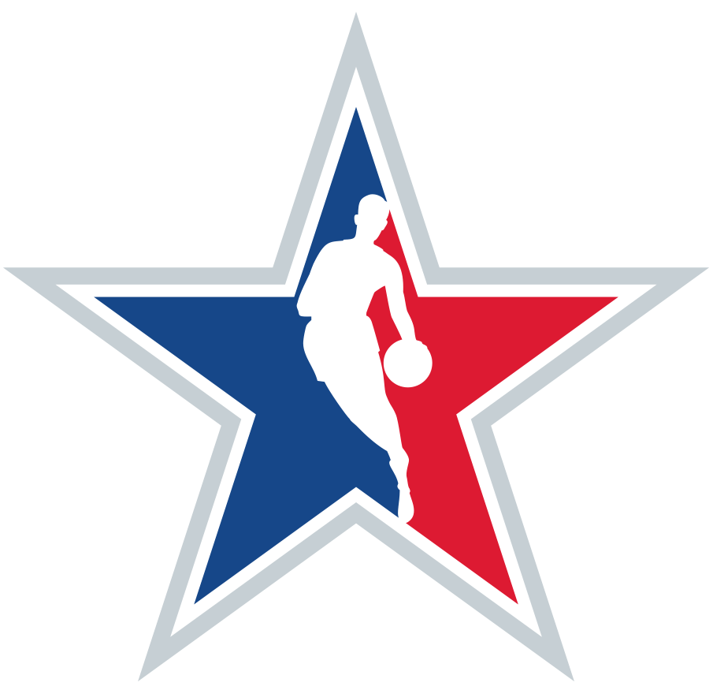
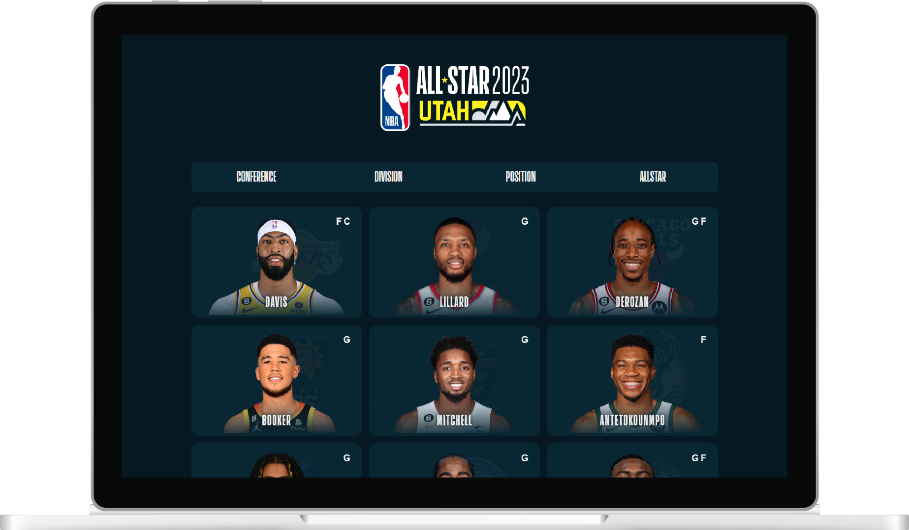
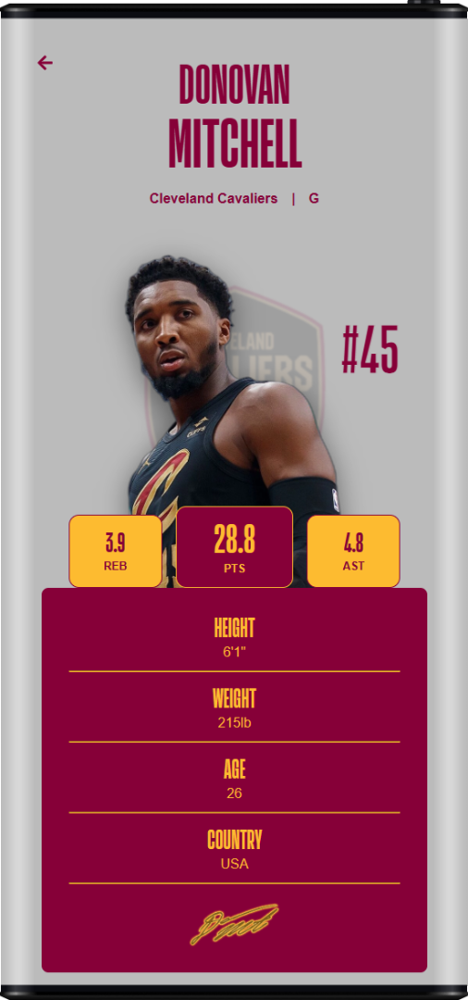

 

    

<h1 align=center>NBA All-Star Players</h1>

    <a href='https://nba-all-star-players.vercel.app/'>nba-all-star-players.vercel.app</a>
      
    
    &nbsp;
    
    &nbsp;
    
    &nbsp;
    
    &nbsp;
    

&nbsp;

    
    &nbsp;&nbsp;&nbsp;&nbsp;
    

&nbsp;

## 💡 Motivation

As a basketball fan, this project was a perfect opportunity to start learning about Databases and further practice my Front-end skills.

That is my first time using React + Express + MongoDB, a lot of things could be better structured and it certainly will be in future projects.

&nbsp;

## ⚙️ How it works

### MongoDB

MongoDB was choosen to storage data from players and teams in sepparated collections.

### Express

The application needs a Node Back-end to process requests and send the proper responses, Express was used to facilitate all the work.

### Assets

All hand-picked assets of players and teams are stored in another GitHub [repository](https://github.com/gabriel-dp/NBA-AllStar-Players-Assets). Some automations using Python (Selenium) were made to automate repetitive tasks.

&nbsp;

## ✅ Legal

This is a unofficial, non-commercial and non-profit project.

All data, logos and images (c) 2023 NBA
